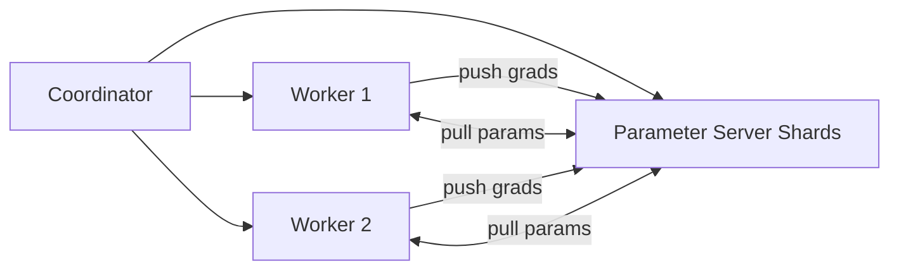

# DistroML – System Architecture (Laptop-Friendly, CPU-First MVP)

> **Project status:** Active development. This architecture is written to be **doable on a personal laptop with no GPUs**, while keeping the design extensible to multi-GPU/multi-node clusters later.

---

## 1. Purpose

DistroML is a distributed machine learning training framework focused on:
- **Scalability:** multi-process / multi-node execution
- **Communication efficiency:** optimized synchronization + optional compression
- **Fault tolerance:** checkpoint + recovery + failure handling
- **Observability:** real-time metrics, logs, cluster health

This document covers:
1) Component interaction diagrams (workers, coordinator, optional parameter server)
2) Communication patterns & network topology design
3) Fault tolerance & recovery strategies
4) API design for framework integration (Keshav + Romaisa scope)

---

## 2. Design Principles

### 2.1 MVP-first, extensible-by-design
We build a working vertical slice:
- Job submission → training runs distributed → metrics stream live → checkpoint → recovery on failure

Then extend:
- GPU backends (NCCL), Kubernetes, hybrid parallelism, multi-cloud, advanced compression

### 2.2 CPU-first development mode (no lab needed)
DistroML must run locally using:
- **PyTorch Distributed + Gloo** backend (CPU)
- Multiple processes (or containers) on a single laptop
- Small models/datasets or synthetic data for fast tests

This keeps development unblocked while preserving the same distributed control flow used at scale.

---

## 3. High-Level Architecture

DistroML follows a **Control Plane / Training Plane** split.

- **Control Plane**: API, Coordinator, Scheduler, Metadata, UI/Monitoring
- **Training Plane**: Workers, Comm Backend, Checkpointing, Metrics emission

```mermaid
flowchart LR
  UI[Dashboard (React)] --> API[API Server (FastAPI)]
  API --> COORD[Coordinator]
  COORD --> SCHED[Scheduler]
  COORD <--> WORKERS[Training Workers]
  WORKERS <--> COMM[Comm Backend<br/>Gloo (CPU) / NCCL (GPU) / MPI]
  COORD --> META[(Postgres Metadata)]
  COORD --> CKPT[(Checkpoint Store<br/>Local/MinIO/S3)]
  WORKERS --> OBS[Metrics/Logs]
  OBS --> UI
````

---

## 4. Core Components

### 4.1 API Server (FastAPI)

**Responsibilities**

* Job submission/cancel/status
* Cluster status endpoints
* Real-time streaming (WebSocket)
* Input validation (JobSpec schema)
* Auth (optional MVP: API key stub / dev mode)

**Owns**

* Stateless (persists in Postgres, runtime in Coordinator)

---

### 4.2 Coordinator (Control-plane brain)

**Responsibilities**

* Job lifecycle state machine (QUEUED → RUNNING → COMPLETED/FAILED/RECOVERING)
* Worker registration + heartbeats
* Strategy planning (MVP: data parallel; later model/pipeline)
* Fault detection + recovery orchestration
* Checkpoint commit logic (manifest-based “atomic commit”)

**Owns**

* In-memory runtime job state
* Durable job/run state in Postgres
* Worker membership view

---

### 4.3 Scheduler (Resource assignment)

**Responsibilities**

* Assign workers/CPU/GPU resources per job
* Enforce quotas (max workers per job, memory hints)
* MVP: simple FIFO / priority queue
* Later: topology-aware scheduling, autoscaling (Kubernetes)

**Owns**

* Resource inventory (from worker registration and periodic reports)

---

### 4.4 Training Worker

**Responsibilities**

* Execute training loop (forward/backward/optimizer)
* Participate in distributed synchronization
* Apply gradient compression hooks (optional)
* Periodically emit metrics/logs to Coordinator/API stream
* Write checkpoint shards (or single checkpoint in MVP)

**Owns**

* Local model/optimizer state
* Local training step counter
* Temporary checkpoint artifacts before upload

---

### 4.5 Comm Backend (Abstraction Layer)

**Goal:** isolate distributed primitives from framework logic.

**Responsibilities**

* Initialize distributed context (rank/world, process group)
* Provide primitives:

  * allreduce(tensor)
  * allgather(tensor)
  * reduce_scatter(tensor)
  * send/recv
* MVP: **Gloo** (CPU) + PyTorch distributed
* Later: NCCL for GPUs, MPI for HPC

---

### 4.6 Metadata Store (Postgres)

**Responsibilities**

* Persist job specs, statuses, run history
* Persist metrics pointers or aggregated metrics (MVP)
* Store checkpoint references (manifests)

---

### 4.7 Checkpoint Store (Local / MinIO / S3)

**Responsibilities**

* Store checkpoint artifacts
* Provide versioned storage per run
* Allow atomic “commit” via manifest file

MVP storage options:

* Local filesystem path (`./checkpoints/...`)
* Local MinIO via Docker Compose (S3-compatible)

---

### 4.8 Observability (Metrics + Logs)

**MVP**

* Workers send metrics to Coordinator (in-memory buffer) and API WebSocket
* Logs streamed + stored (file or DB table)

**Later**

* Prometheus scraping
* Grafana dashboards
* Jaeger tracing
* ELK logging

---

## 5. Component Interaction Diagrams

### 5.1 Job Submission → Launch → Train → Stream → Complete

```mermaid
sequenceDiagram
  participant U as User/UI
  participant A as API Server
  participant C as Coordinator
  participant S as Scheduler
  participant W as Workers
  participant K as Checkpoint Store
  participant D as Postgres

  U->>A: POST /api/jobs (JobSpec)
  A->>C: Validate + create job
  C->>D: Persist job + run record
  C->>S: Request resources (workers, backend)
  S-->>C: Allocation plan
  C->>W: Launch config (rank/world/strategy)
  loop Training
    W->>C: Heartbeat + metrics (step, loss, throughput)
    C-->>A: Aggregate status + metrics
    A-->>U: WebSocket stream updates
  end
  W->>K: Write checkpoint shard(s)
  C->>K: Commit manifest (atomic)
  C->>D: Mark run complete + store checkpoint pointer
  C-->>A: Completed
  A-->>U: Final status + summary
```

---

### 5.2 Training Loop (Data Parallel, MVP)

```mermaid
flowchart TB
  B[Get Batch] --> F[Forward]
  F --> L[Loss]
  L --> BW[Backward]
  BW --> COMP[Compression Hook (optional)]
  COMP --> AR[AllReduce Gradients]
  AR --> OPT[Optimizer Step]
  OPT --> M[Emit Metrics]
  M --> B
  AR <--> COMM[Comm Backend: Gloo/NCCL/MPI]
```

---

### 5.3 Optional: Parameter Server Mode (Future / Extensible)

> Not required for MVP, but documented for completeness.



---

## 6. Communication Patterns & Network Topology

### 6.1 Communication patterns by strategy

| Strategy              | What is split? | Main comm ops             | MVP status |
| --------------------- | -------------- | ------------------------- | ---------- |
| Data Parallel         | data batches   | AllReduce gradients       | ✅ MVP      |
| Model/Tensor Parallel | layers/tensors | AllGather / ReduceScatter | Planned    |
| Pipeline Parallel     | layer stages   | send/recv activations     | Planned    |
| Parameter Server      | parameters     | push/pull params/grads    | Optional   |

### 6.2 Network topology design (works on laptop + scales later)

**Laptop mode (single machine)**

* World size = N processes (e.g., 2–4)
* Backend = **Gloo**
* Topology = loopback networking / local IPC (managed by PyTorch)

**Scale-up (single node, multi-GPU)**

* Backend = NCCL
* Prefer intra-node fast links (NVLink/PCIe)

**Scale-out (multi-node)**

* Hierarchical collectives:

  * intra-node reduction
  * inter-node reduction
* Reduce cross-node bandwidth:

  * gradient bucketing
  * compression
  * fewer sync points

### 6.3 Backend selection logic

* If GPUs available → NCCL
* Else → Gloo (default)
* If MPI environment detected → MPI backend optional

---

## 7. Fault Tolerance & Recovery

### 7.1 Failure detection

**Signals**

* Heartbeat timeout (e.g., no heartbeat for T seconds)
* Worker exit / exception
* Communication backend error (collective failure)

**MVP implementation**

* Coordinator maintains last-seen timestamps per worker
* Coordinator transitions job state and triggers recovery actions

### 7.2 Checkpointing model (manifest-based atomic commits)

A checkpoint is “valid” only when its **manifest is committed**.

**Structure**

* `run_id/`

  * `checkpoints/ckpt_step_01000/`

    * `manifest.json`  ✅ commit marker
    * `worker_0.pt`
    * `worker_1.pt`
    * ...

**Manifest includes**

* job_id, run_id, step, epoch
* world_size, strategy, backend
* list of shard filenames + hashes
* optimizer state present? RNG state present?

### 7.3 Recovery flows

#### Worker failure during training

1. Coordinator detects missing heartbeat / worker death
2. Coordinator sets job state → `RECOVERING`
3. Coordinator selects latest committed checkpoint manifest
4. Coordinator relaunches workers (or continues with remaining in elastic mode)
5. Workers restore model/optimizer state
6. Training resumes at last safe step

#### Coordinator restart

1. Coordinator reloads jobs/runs from Postgres
2. Workers re-register on startup (idempotent)
3. Coordinator reconciles:

   * If job was RUNNING: either continue or recover from last checkpoint
4. API reflects reconciled state

#### Checkpoint failure (store temporarily unavailable)

* Worker retries upload
* Coordinator does not commit manifest until all shards succeed
* Training may continue; next checkpoint attempt proceeds

---

## 8. API Design for Framework Integration (Keshav + Romaisa)

### 8.1 Public REST API (FastAPI)

#### Jobs

* `POST /api/jobs` — submit a job
* `GET /api/jobs/{job_id}` — job status/details
* `DELETE /api/jobs/{job_id}` — cancel job
* `GET /api/jobs/{job_id}/metrics` — metrics query (range/window)
* `GET /api/jobs/{job_id}/logs` — logs query

#### Cluster

* `GET /api/cluster/workers` — worker list + health
* `GET /api/cluster/resources` — CPU/GPU/memory summary (best-effort)

#### Experiments (MVP)

* `GET /api/experiments` — list runs
* `GET /api/experiments/{run_id}` — run details + artifacts
* `POST /api/experiments/compare` — compare runs (basic)

---

### 8.2 Real-time WebSocket streaming

* `WS /api/jobs/{job_id}/stream`

Event types:

* metric: loss/acc/lr/throughput
* resource: CPU/GPU utilization (if available)
* log: structured logs
* state: job status transitions (RUNNING/RECOVERING/etc.)

Example payloads:

```json
{ "type": "metric", "step": 120, "loss": 1.234, "throughput": 540 }
```

```json
{ "type": "state", "status": "RECOVERING", "reason": "heartbeat_timeout_worker_2" }
```

---

### 8.3 JobSpec (public submit format)

Minimum viable schema:

```json
{
  "name": "mnist-ddp-demo",
  "framework": "pytorch",
  "model": "mlp",
  "dataset": "synthetic",
  "resources": { "workers": 4, "gpus_per_worker": 0 },
  "distributed": { "strategy": "data_parallel", "backend": "gloo" },
  "hyperparameters": { "batch_size": 64, "lr": 0.001, "epochs": 2 },
  "checkpointing": { "enabled": true, "every_n_steps": 200, "store": "local" },
  "compression": { "enabled": false }
}
```

---

## 9. Framework Adapter Layer (Internal API)

To support multiple frameworks without rewriting the runtime, DistroML uses a common adapter interface.

### 9.1 Adapter contract (internal)

```text
FrameworkAdapter:
  build_model(spec) -> ModelHandle
  build_dataloader(spec, rank, world_size) -> Iterator[Batch]
  init_distributed(plan) -> DistContext
  train_step(state, batch, dist) -> (new_state, metrics)
  serialize_state(state) -> bytes|dict
  deserialize_state(blob) -> state
```

### 9.2 MVP adapter implementation

* **PyTorchAdapter (MVP)**

  * torch.distributed init (Gloo)
  * DistributedSampler for sharded data
  * DDP wrap (optional in CPU; still supported)

Planned:

* TensorFlow adapter
* JAX adapter
* Hugging Face integration via adapter templates

---

## 10. Development & Deployment Modes

### 10.1 Laptop Dev Mode (Recommended)

* Run Coordinator + API on localhost
* Spawn N worker processes locally
* Backend: Gloo
* Storage: local filesystem or local MinIO

### 10.2 Local “Mini-Cluster” via Docker Compose (Recommended demo)

Services:

* coordinator/api
* N workers
* postgres
* minio
* (optional) prometheus/grafana

### 10.3 Production mode (Future)

* Kubernetes operator + CRD for TrainingJob
* Autoscaling
* Prometheus/Grafana/ELK/Jaeger full stack


## 11. MVP Definition of Done (Doable without GPUs)

DistroML MVP is considered successful when:

* A job can be submitted via REST API
* Workers run distributed training on CPU (2–4 processes) using Gloo
* Metrics stream live to a WebSocket consumer
* Checkpoints are saved and a manifest is committed
* Killing a worker triggers recovery and training resumes
* Runs are recorded in Postgres and visible via API


## 12. Future Extensions (Not required for MVP)

* GPU NCCL backend support + topology-aware scheduling
* Hybrid parallelism engine (data + model + pipeline)
* Advanced gradient compression (Top-K, PowerSGD, 1-bit SGD)
* Kubernetes operator + autoscaling
* Multi-cloud deploy templates
* MLflow / W&B integrations


